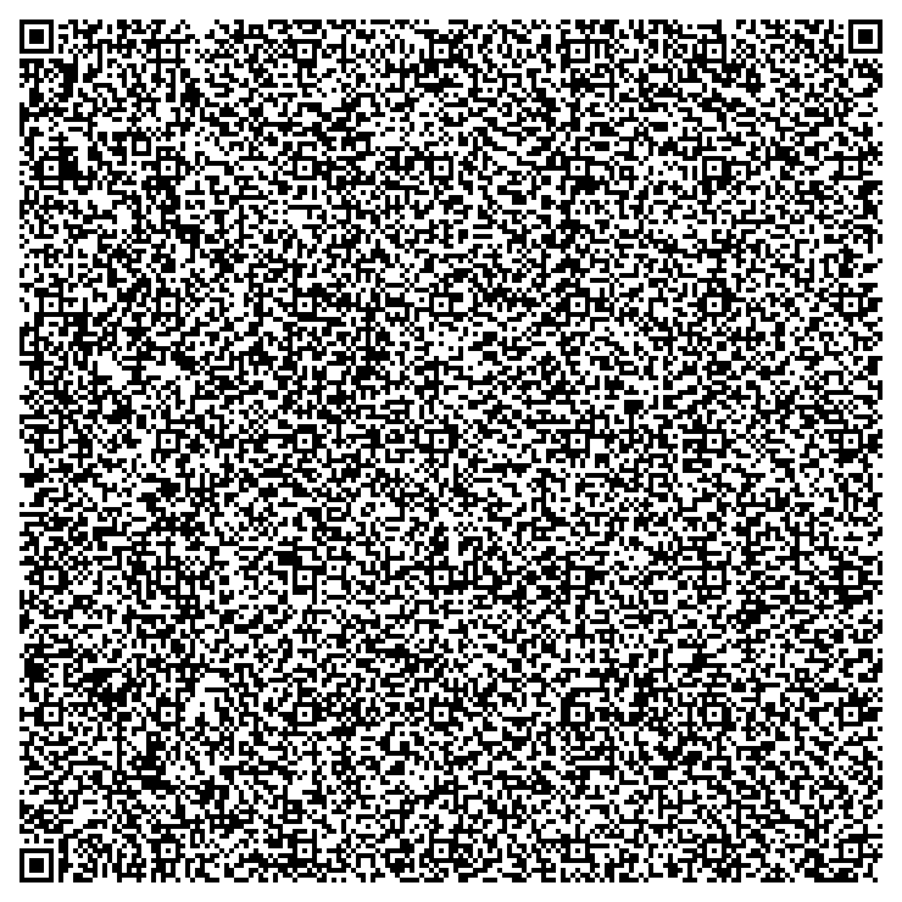
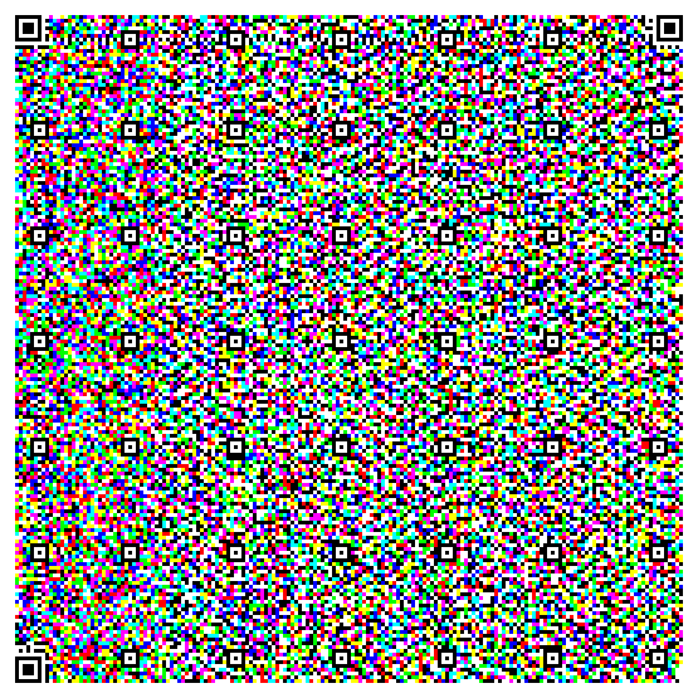

     
    
    
    

# ChromaQR
A traditional QR code allows for a maximum of just [2953 bytes](https://www.qrcode.com/en/about/version.html) to be encoded, as it only uses black and white colours. I saw an easy upgrade here: why not use the three RGB colour channels separately to triple the storage to 8859 bytes? So that's what ChromaQR does.

## Quick Start
- Install the Python package with `pip install git+git://github.com/w-henderson/ChromaQR.git#egg=ChromaQR`.
- You can now encode ChromaQR codes with `chromaqr encode --text "Some text here" --outFile encoded.png` or `chromaqr encode --inFile bigText.txt --outFile encoded.png`.
- You can decode ChromaQR codes with `chromaqr decode --inFile encoded.png` to print the decoded text to the console or `chromaqr decode --inFile encoded.png --outFile decoded.txt`.

## How does ChromaQR work?
ChromaQR simply splits the data you're trying to encode into three chunks, then converts each of the three chunks into a regular QR code. These three QR codes are then treated as the red, green and blue channels of an image, which are then combined into the final ChromaQR code. To decode, this process is performed in reverse, but due to the nature of cameras, red, green and blue are not necessarily equal so additional processing is performed to ensure each of the three regular QR codes can be decoded properly.

## Benefits of ChromaQR
Imagine, if you will, that you were trying to fit as much of the Bee Movie script into a QR code as possible. With a traditional QR code, you can only fit the first 5 minutes and 44 seconds even after turning error correction all the way down. On the other hand, with a ChromaQR code, you can cram in a whopping 21 minutes and 3 seconds into the same space, without applying any additional compression. Alongside this, ChromaQR codes are just as easy to scan as traditional QR codes.

| 5:44 of the Bee Movie script | 21:03 of the Bee Movie script |
| --- | --- |
|  | 